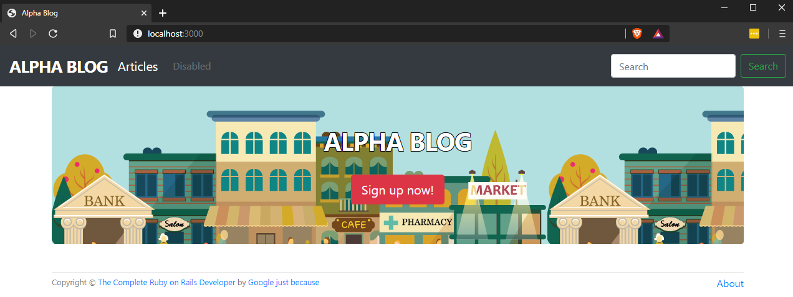

# README

This README would normally document whatever steps are necessary to get the
application up and running.

From project home:
Example to make controller: `rails generate controller pages`

Used scaffold to make it a little easier: `rails generate scaffold Article title:string description:text`

* Ruby version: 2.6.5

* System dependencies: `rails webpacker:install` | [Bootstrap](https://getbootstrap.com/docs/4.4/getting-started/download/)

* Database creation: `rails db:migrate`

* Database initialization: Coming...

* How to run the test suite: Coming...

* Services (job queues, cache servers, search engines, etc.): Coming...
