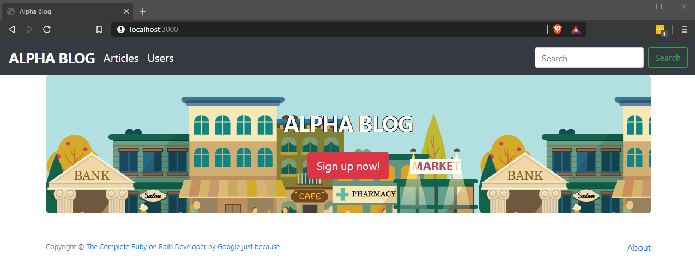

Example to make controller: `rails generate controller pages`

Used scaffold to create objects: `rails generate scaffold Article title:string description:text`

* Ruby version: 2.6.5
* System dependencies: `rails webpacker:install` | [Bootstrap](https://getbootstrap.com/docs/4.4/getting-started/download/)
* Database creation: `rails db:migrate`
* How to run the entire test suite: `rake test`
